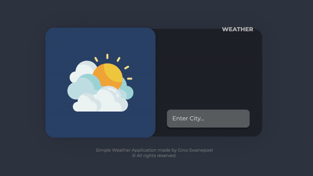

<h1 align="center">⛅ React Weather App ⛅</h1>

<h4 align="center"> A basic weather application made in React, constructed with create-react-app, featuring OpenWeatherMap's API and Hooks. </h4>
<br/>
<p align="center">
  
  <a href="#" target="_blank">
    
  </a>
  <a href="https://twitter.com/mrginolee" target="_blank">
    
  </a>
</p>

<h2 align="center">☀️ <a href="https://ginoleeswan.github.io/weather-app-basic/">See Live</a> ☀️</h2>

<p align="center">
  
</p>

<h2 align="right">📖 &nbsp; Lessons Learned</h2>

<div align="right">

This was my second react project, after the mandatory to-do list!
Learned how to make **external API calls** to pull weather infomation from a third party site.

With this project I started to get more comfortable using **Hooks** rather than class based components. I definitely see the appeal. It removes all the hassle of having to bind to 'this' continuously. Being able to use the setState method with props makes **state management** simpler and more elegant.

I started off with super simple CSS and then modified the app into a left page and right page component. The left page delivers the main information and the right contains the search bar as well as extra information.

This application also tested my skills in adapting & optimizing the responsive web page to fit on **mobile screens**. After quite a bit of tweaking I settled on a simplified vertical mobile view design where the right page fits under the left like a stack of cards.

</div>

## 🔮 &nbsp; Potential Future Features

- 📅 &nbsp; 3-Day / Week view
- 🌡️ &nbsp; Celsius to Fahrenheit converter
- 🧭 &nbsp; A compass to easily visualise wind direction
- 🏙️ &nbsp; Dynamic backgrounds based on AM/PM and specific weather conditions

<h2 align="right">🚀 &nbsp; Deployment</h2>
<div align="right">
Deployed with Github Pages
</div>

## 🔨 &nbsp; Get Started

From your commang line, first clone this repo:

```sh
# Clone this repository
$ git clone https://github.com/ginoleeswan/weather-app-basic/

# Go into the repository
$ cd weather-app-basic

# Remove current origin repository
$ git remote remove origin
```

### Install

```sh
npm install
```

### Usage

```sh
npm run start
```

### Run tests

```sh
npm run test
```

<div align="right">

## ✍️ &nbsp; Author

👤 **Gino Swanepoel**

&nbsp; Twitter: [@mrginolee](https://twitter.com/mrginolee)\
 &nbsp; Github: [@ginoleeswan](https://github.com/ginoleeswan)\
 &nbsp; LinkedIn: [@ginoswanepoel](https://linkedin.com/in/ginoswanepoel)

</div>

## ❤️ &nbsp; Show your support

Give a ⭐️ if this project helped you!
